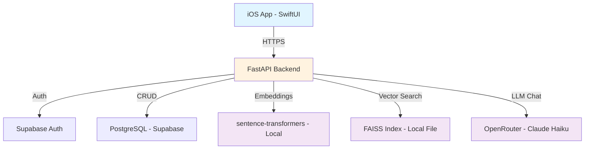
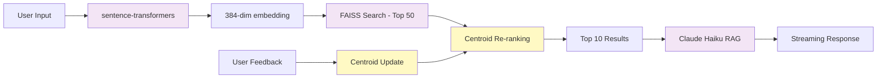
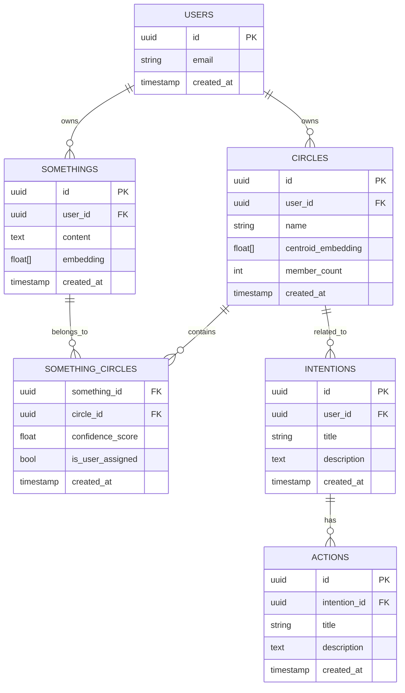

# 🧠 Pookie

**Personal LLM with Centroid-Based Reinforcement Learning**
YOUTUBE SHOWCASE: https://youtu.be/wq6wvbSZ264
[](https://www.apple.com/ios/)
[](https://swift.org)
[](https://www.python.org/)
[](https://fastapi.tiangolo.com/)
[](LICENSE)

---

## 💡 Why I Built This

**The Problem:** ChatGPT doesn't know me. It's great for generic questions, but it has no memory of what I care about, my projects, or my personal knowledge. Every conversation starts from zero.

**What I Tried:**
- Note-taking apps: Manual organization, no intelligence
- Notion/Obsidian: Great for structured docs, terrible for quick thoughts
- Apple Notes: Easy capture, impossible to find anything later
- RAG tools: Generic retrieval, no personalization

**What I Actually Needed:** An AI that learns my personal semantics. Not just "what does 'running' mean in general?" but "why do I care for 'running'?" (Anime scenes, goals to lose weight, goals to increase ability to move).

**So I built Pookie** - a personal LLM powered by centroid-based reinforcement learning that learns from user feedback in real-time, over time.

---

## 🎯 What It Does

Pookie is a personalized knowledge companion with four core capabilities:

### 1. 📝 Capture Anything (Somethings)
- Quick text capture for thoughts, ideas, notes, quotes
- Automatic semantic embedding (sentence-transformers, local, fast)
- Voice capture coming in v2 (iOS Speech Recognition)

### 2. 🎯 ML-Powered Organization (Circles)
- **K-means clustering** automatically organizes somethings into semantic circles
- **LLM-generated names** for each circle (e.g., "Career Growth", "Creative Ideas")
- **Centroid-based predictions** suggest which circle new somethings belong to
- **Reinforcement learning loop**: When you correct predictions, centroids shift to match YOUR semantics (In-Progress)

### 3. 💬 Personalized Chat (RAG)
- Chat with YOUR knowledge base, not generic ChatGPT
- **Hybrid retrieval scoring**: 40% base FAISS + 40% circle centroids + 15% user feedback + 5% recency
- Streaming responses (Server-Sent Events with Claude Haiku)
- See which circles informed each answer

### 4. 🎯 Care Hierarchy (Intentions → Actions)
- **Intentions**: High-level goals linked to circles of care
- **Actions**: Concrete steps toward intentions
- Track what you're doing and why it matters
- Knowledge Graph Visualization (In-Progress)

---

## 🧪 The ML Innovation: Centroid-Based RL

**Why not fine-tuning?**
- Fine-tuning takes hours/days and requires GPUs
- Centroid updates take <50ms and run on a free-tier CPU
- Centroids are interpretable (you can visualize how they shift)
- Real-time learning: feedback → centroid update → better predictions immediately

**How it works:**

1. **Base Embeddings (sentence-transformers):**
   ```
   "I want to run a 5K" → [0.23, -0.15, 0.08, ..., 0.42]  # 384-dim vector
   ```

2. **Circle Centroids (incremental mean):**
   ```python
   # When you assign something to a circle:
   centroid_new = (N * centroid_old + embedding_new) / (N + 1)

   # When you remove something:
   centroid_new = ((N + 1) * centroid_old - embedding_removed) / N
   ```

3. **Hybrid Similarity Scoring:**
   ```python
   final_score = (
       0.40 * cosine_similarity(query, embedding_base) +      # Universal semantics
       0.40 * cosine_similarity(query, circle_centroid) +     # Personal semantics
       0.15 * (1.0 if is_user_assigned else 0.0) +            # User feedback boost
       0.05 * recency_score                                    # Time decay
   )
   ```

4. **Learning Loop:**
   ```
   User creates something → System predicts Circle A (0.75 confidence)
                          ↓
   User corrects: "Actually, Circle B" → Centroid B shifts toward new embedding
                          ↓
   Next similar something → System predicts Circle B (0.85 confidence) ✨
   ```

**Result:** Personalized semantic retrieval that learns YOUR meaning of concepts, not Wikipedia's.

---

## 🏗️ Architecture

### System Diagram



### ML Pipeline



### Data Model



---
** Cost (Free Tier):**
- **Backend hosting (Render):** $0/month (750 hours free)
- **Database (Supabase):** $0/month (500MB limit)
- **Embeddings (local):** $0/month (no API)
- **Vector search (FAISS):** $0/month (local file)
- **LLM chat (Claude Haiku):** ~$0.50-3/month (depending on usage)

**Total:** ~$0-3/month for a personal AI system 🎉

---

## 🔮 Future Vision (v2+ )

**Advanced ML Features:**
- **Voice capture**: iOS Speech Recognition for real-time thought capture
- **Multi-circle assignments**: One something, multiple relevant circles
- **Confidence thresholds**: Auto-assign high confidence, suggest low confidence
- **Learning analytics**: Visualize how centroids evolve over time
- **Cross-user vibe matching**: Find people with similar circle patterns (privacy-preserving)

**Reality Integration:**
- **AR knowledge graph**: Visualize circles in 3D space
- **Location tagging**: Attach thoughts to physical places.
- **Cross-device sync**: iOS + Web + Android
- **Offline-first**: Work without internet, sync later

**Discovery Mode:**
- **Recommendation engine**: Suggest articles/music based on YOUR circles
- **Pattern detection**: "You think about X when Y happens"
- **Reflection prompts**: Weekly summaries of circle activity

---

## 💡 Why This Matters (Recruiting Narrative)

This project demonstrates:

✅ **Reinforcement learning from human feedback**: Centroid-based RL that learns in real-time (<50ms updates)
✅ **Personalized semantic architectures**: Hybrid FAISS + centroid retrieval (not vanilla RAG)
✅ **End-to-end ML systems**: Embeddings → Vector search → Incremental learning → Multi-stage retrieval
✅ **Full-stack development**: iOS (SwiftUI + @Observable) + Backend (FastAPI + async/await)
✅ **Advanced ML techniques**: sentence-transformers, FAISS, hybrid scoring, learning signals
✅ **Cost-conscious engineering**: Free-tier architecture (~$0-3/month) proving technical efficiency
✅ **Product thinking**: Real problem, real solution - not just a tech demo
✅ **Modern patterns**: SwiftUI MVVM, SQLAlchemy async, SSE streaming, JWT auth

I wanted a cognitive architecture that learns personal semantics through feedback - using centroid-based RL, hybrid vector retrieval, and incremental learning.

---

## 📖 Further Reading

- **[DEMO-SCRIPT.md](docs/DEMO-SCRIPT.md)**: 7-minute recruiting demo walkthrough
- **[ML-ARCHITECTURE.md](docs/ML-ARCHITECTURE.md)**: Deep dive into centroid RL system
- **[pookie-semantic-architecture.md](docs/pookie-semantic-architecture.md)**: Full system architecture document

---

## 📄 License

MIT License - see [LICENSE](LICENSE) for details.

This is a personal project built to demonstrate ML engineering skills.

---

## 🙏 Acknowledgments

**Technologies:**
- [FastAPI](https://fastapi.tiangolo.com/) - Modern Python web framework
- [sentence-transformers](https://www.sbert.net/) - Semantic embeddings
- [FAISS](https://github.com/facebookresearch/faiss) - Facebook AI Similarity Search
- [Supabase](https://supabase.com/) - Open-source Firebase alternative
- [OpenRouter](https://openrouter.ai/) - LLM API aggregation
- [SwiftUI](https://developer.apple.com/xcode/swiftui/) - Apple's declarative UI framework

**Inspiration:**
- Personal frustration with generic productivity tools
- Research in personalized learning systems
- Belief that AI should adapt to humans, not the other way around

---
